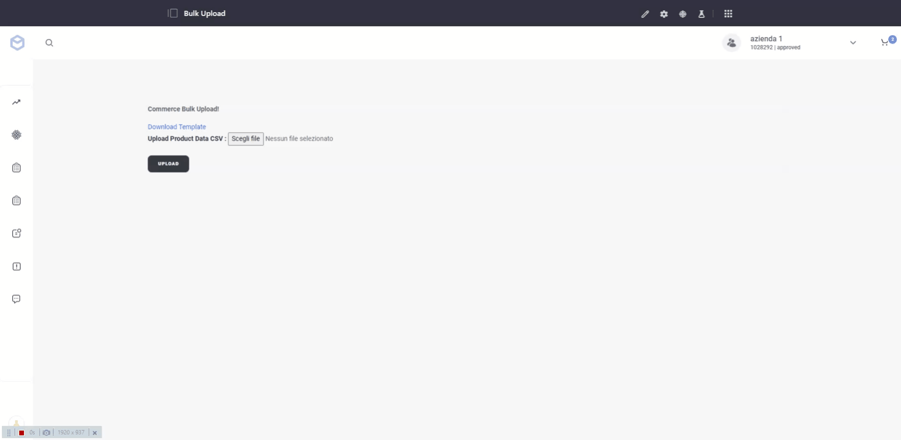

# Commerce Bulk Upload

## Usage
This module allows you to order products starting from a CSV file with one form submission. 
## Requirements
- Liferay 7.3
- Liferay Commerce 3.0.0
## Installation
- Download the .jar file in releases and deploy it into Liferay.

or

- Clone this repository, add it to a Liferay workspace and deploy it into Liferay.
## License
[MIT](https://choosealicense.com/licenses/mit/)
